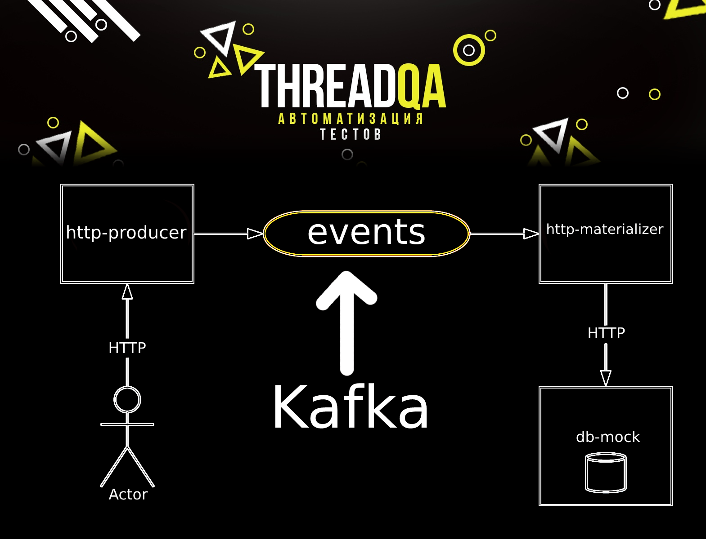

# Репозиторий с различными Kafka интеграционными тестами





## Модули проекта
1. Kafka Streams - содержит примеры модульных тестов для топологий потоковой передачи. 
Подход охватывает тестирование топологий с сохранением состояния и без сохранения с различными сердами (Avro Serializer/Deserializer)
2. Kafka Cluster - модуль кластера, который запускается в Runtime режиме, включающий в себя 1 Zookeeper, 1 Kafka Broker, 1 Confluent Schema Registry. Этот кластер будет использован для запуска интеграционных тестов для Kafka приложения
3. Producer Consumer - содержит примеры интеграционных тестов, взаимодействующие с кафка кластером. Пример включают в себя отправку и получение String и Avro сообщений
4. Data Pipeline - пример приложения, который обрабатывает Kafka Stream и преобразовывает сообщения, содержит пример интеграционных тестов с заглушками [Wire mock](http://wiremock.org)
5. E2E Docker - Интеграционные тесты для объединенного микросервиса в Data Pipeline модуля, обёрнутыми в [тестовые докер контейнеры](https://www.testcontainers.org)

Генерация Avro моделей из ресурсов
```
./gradlew generateAvro
./gradlew data-pipeline:http-materializer:generateAvro
./gradlew data-pipeline:http-producer:generateAvro
```
